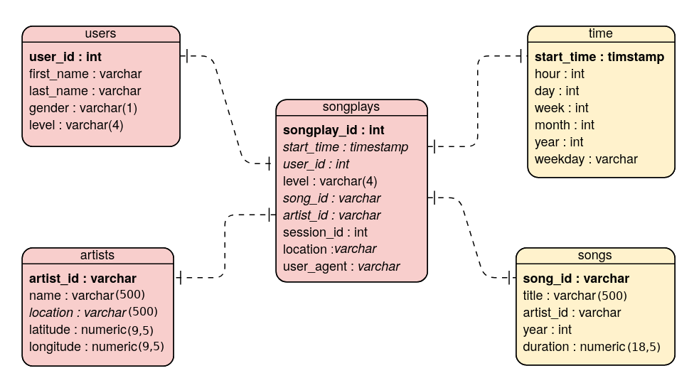
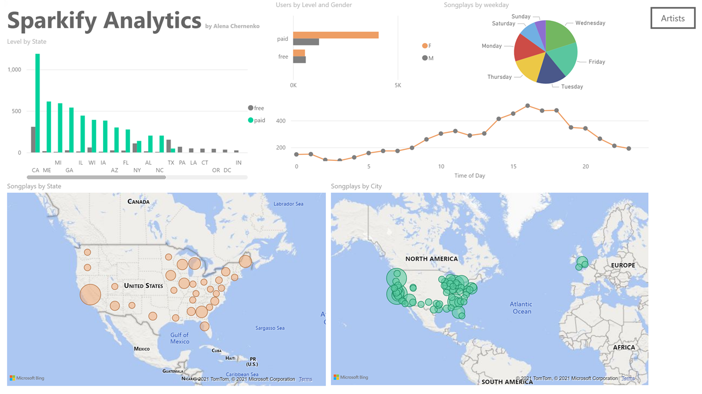

# Project 3: Data Warehouse - DWH implementation with Amazon Redshift

## Table of contents:
1. [Project Summary](https://github.com/alena-c/aws_dwh/blob/main/README.md#1-the-purpose-of-the-database-in-the-context-of-srartup-sparkify-and-their-analytical-goals) <br>
2. [Shema and ETL Pipeline](https://github.com/alena-c/aws_dwh/blob/main/README.md#2-state-and-justify-your-db-schema-desing-and-etl-pileline)<br>
2.1 [Schema design](https://github.com/alena-c/aws_dwh/blob/main/README.md#21-schema-design-schema-for-song-play-analysis-)<br>
2.2 [ETL Pipeline](https://github.com/alena-c/aws_dwh/blob/main/README.md#22-etl-pipeline)<br>
2.3 [Project Repository Files](https://github.com/alena-c/aws_dwh/blob/main/README.md#23-project-repository-files)<br>
2.4 [How to Run the Project](https://github.com/alena-c/aws_dwh/blob/main/README.md#24-how-to-run-the-project)<br>

3. [Dashboard](#dashboard)

Do the following steps in your README.md file.

    Discuss the purpose of this database in context of the startup, Sparkify, and their analytical goals.
    State and justify your database schema design and ETL pipeline.
    [Optional] Provide example queries and results for song play analysis

### 1. The purpose of the database in the context of srartup, Sparkify, and their analytical goals.

* nusic streaming app (Sparkify) -> grown user base and song database -> move their procceses and data to cloud:
 -- data resides in S3 (in a directory of JSON logs on app's user activity + JSON metadata on the app's songs.
 -- task for DE: build an ETL pipeline that extracts thier data from S3, stages it in Redshift, and transforms data into a set of dimensional tables for their analytics team to continue finding insights in what songs their users are listening to.
 -- DE will be able to test your database and ETL pipeline by running queries given to you by the analytics team from Sparkify and compare your results with their expected results. ?????????????? (move to questions)

* Project Description:
 -- Apply what you've learned on data warehouses and AWS to build an ETL pipeline for a database hosted on Redshift. To complete the project, you'll need to load data from S3 to staging tables on Redshift and execute SQL statements that create the analytics tables from these staging tables.

* Project Datasets:
-- You'll be working with two datasets that reside in S3:
 1) Song data: s3://udacity-dend/song_data
 2) Log data:  s3://udacity-dend/log_data
 3) Log data json path: s3://udacity-dend/log_json_path.json
 4) 
 5) https://s3.console.aws.amazon.com/s3/buckets/udacity-dend

* Song Dataset
* The song dataset is a subset of real data from . Each file is in JSON format and contains metadata about a song and the artist of that song. The files are partitioned by the first three letters of each song's track ID. For example, here are filepaths to two files in this dataset.
```
song_data/A/B/C/TRABCEI128F424C983.json
song_data/A/A/B/TRAABJL12903CDCF1A.json
```

* Log Dataset
-- The second dataset consists of log files in JSON format generated by this  based on the songs in the dataset above. These simulate app activity logs from an imaginary music streaming app based on configuration settings.
-- The log files in the dataset you'll be working with are partitioned by year and month(actually only one month is available). For example, here are filepaths to two files in this dataset.
```
log_data/2018/11/2018-11-12-events.json
log_data/2018/11/2018-11-13-events.json
```
(this jupyter notebook file --> will allow to view the structure of the files)

* The database:
    * Was created for the analysis of the Sparkify music streaming data logs on songs and user activity.
    * Since the analytics team is interested in the users' music choises, this database helps to perform such analysis. This relational database is a perfect solution for ease of quering the data as apposed to getting the data from the files stored in JSON logs.

***

### 2. State and justify your db schema desing and ETL pileline
#### 2.1 Schema design (Schema for Song Play Analysis)
 
* The following image is an ER diagram for the implemented **star schema**:

    * The schema, consists of four **dimension tables** (`users`, `songs`, `artists`, `time`) and **fact table** `playsongs`. (An additional ER diagram could be created with `'er_diagram.py'` and it's output could be found in [sparkifydb_erd.png](sparkifydb_erd.png))
    * Each of the **dimension tables** has a **primary key** -- i.e., `users: `**`user_id`**, `songs: `**`song_id`**, `artists: `**`artist_id`**, and `time: `**`start_time`**. These **dimension tables** are referenced by the `songplays` table with the corresponding _foreign keys_(in italic). 
    * Additionally, each of the dimension table allows for a simple answer of the Sparkify's needs regarding the users and songs (and if needed artists and time details).
    * Specifically, the dimension tables have the following purposes:
      - `users` table keeps all information on the Sparkify users, including their names, gender and the level of subscription they have (free or paid). In addition, it is allowed to update that status (`level`). A new 'upsert' query would make an update on the level if it encounters an already existing `user_id`.
      - `artists` table keeps all information separately about the artists, including their name, location, and location's coordinates (latitude and longitude).
      - `songs` table hold specific information related to a song played, i.e., title of the song, name of the artist for that song, song's production year and duration.
      - `time` table holds all detailed information regarding the time stamp for the played song. All this information was extracted from the timestamp directly using the pandas datetime function, such as hour, day, week, month, year (as integers) and the day of the week the song was played.
    * In addition to it's **primary key** and the _foreign keys_ mentioned above, the fact table `songplays` also records the user's subscription level, location, session_id, and the user_agent information of user's system on which they played the song.
    * Such desing is perfect for the business problem. The denormalized tables allow for easy quering and fast aggregation of all needed information as well as help to perform easy joins. 

#### 2.2 ETL Pipeline

* Initially, the song data ([data/song_data](./data/song_data)) is processed by iterating the directory's json files and making insertions about each new song into the `artists` and `songs` tables. This happens in etl.py process_song_file() function.
* The log data ([data/log_data](./data/log_data)) is processed by iterating the directory's json files and making  the insertions of each log into the `users`, `time` tables, and, partially, into the `songplays` table (etl.py process_log_file() function).
* Both data directories are extracting the data by creating, and populating Pandas dataframes, after what the insertions are made into the relevant tables by executing  cur.execute(`TABLE_NAME`_table_insert, row) command.

#### 2.3 Project Repository Files

* : This section describes what files are for which purpose in the project 
- [create_tables.py](./create_tables.py) connects to the redshift database, creates the tables (or drop them and re-create new ones if existed). Allows to reset the database and test ETL pipeline. (You can use Query Editor in the AWS Redshift console for testing if this worked).
- [etl.py](./etl.py) loads data from Amazon S3 into staging tables and then process that data into the analytics tables on Amazon Redshift. (and complete the ETL process. ) (The script connects to the Sparkify redshift database, loads log_data and song_data into staging tables, and transforms them into the five tables.)
- [sql_queries.py](./sql_queries.py) creates database DDL, defines SQL statements, which will be imported into the two files above.
- [dwh.cfg](./dwh.cfg) configuration file for the above three files. Redshift database and IAM role info should be added before running `create_tables.py`.
- [README.md](./README.md) is where you'll provide discussion on your process and decisions for this ETL pipeline.

Extra files:
- [create_cluster.py](./create_cluster.py) launches a Redshift cluster and creates an IAM role that has read access to S3.
- [dwh_start.cfg](./dwh_start.cfg) configuration file for `create_cluster.py`.
- [check_cluster_status.ipynb](./check_cluster_status.ipynb) checks cluster's status and opens a TCP port.
- [view_datasets.ipynb](./view_datasets.ipynb) shows datasets that reside on S3. 
- [test.ipynb](./test.ipynb) queries sample data from the analytics tables. 
- [delete_cluster.ipynb](./delete_cluster.ipynb) deletes the Redshift cluster when finished.

#### 2.4 How To Run the Project

_With existing cluster_:
1. create_tables.py
2. etl.py
3. (optional checks) sql_queries.py

_If launching a cluster_:
1. create_cluster.py
2. check_cluster_status.ipynb
3. (optional) view_datasets.ipynb
4. create_tables.py
5. etl.py
6. (optional checks) sql_queries.py
7. (optional) test.ipynb
8. delete_cluster.ipynb


***
### <a name="dashboard"></a> Dashboard 

Here is my dashboard for analytic queries (made with Microsoft Power BI)*:

[](https://app.powerbi.com/view?r=eyJrIjoiZjM5NTlmNzMtNjEyYy00YzgyLTk0YjgtNWFiOTJmZDVjZDc0IiwidCI6IjAyZDljYjNmLTFmZDMtNDQyMS05YjVkLTYwY2MxMzNhNTg3YSIsImMiOjJ9)

*Note: For this dashboard, I used the larger dataset `song-data` also available on S3.
___

:bell: **Additional questions for the reviewer**

1) You said I could create an ER diagram. But I did create it before and included it into this readme file. Is it not good enough because it doesn't have information on what the primary keys are (bold font) and other additional information? 
2) You wrote "I would suggest using proper headings, emphasis, underline the relevant keywords. Use bullet points, add link URLs and images to make the README better." 
I have used the links to the images here, and the headers, and the bullet points. I guess I don't quite understand how this file is supposed to look like to pass your proper format standards. Is it possible to see some example of a perfectly formatted readme file? 
3) A question regarding the template file etl.py. Are we supposed to change its code completely so it's not considered a plagiarism? Or it is not expected for this project?
4) What kinds of data checks are you asking for in this projects as an extra to make this project to stand out?
5) What kind of dashboard are you taking about? Do you simply want an extra ipynb file with visualizations or do you actually want us to integrate some kind of BI tool (like Tableau) into this project? Would it be possible to get a link with examples please?
6) When you talk about the bulk insert of data, do you mean the direct insert from json file -> to postgres tables? Or do you mean converting JSON to CSV first and then use \copy? I've studied the link you shared with me earlier, but i'm still a little bit confused which method I should use here.

I would really appreciate if you comment on this questions! Thank you so much! 🙏🏻

